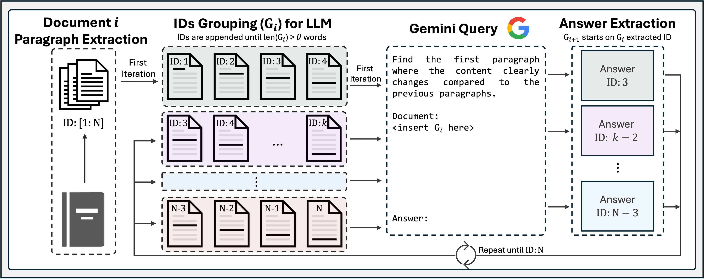

# LumberChunker 🪵🪓
This is the official repository for the paper LumberChunker: Long-Form Narrative Document Segmentation by André V. Duarte, João Marques, Miguel Graça, Miguel Freire, Lei Li and Arlindo L. Oliveira<br>

LumberChunker is a method leveraging an LLM to dynamically segment documents into semantically independent chunks. It iteratively prompts the LLM to identify the point within a group of sequential passages where the content begins to shift.




---
## LumberChunker Example - Segmenting a Book
⚠ Important: Whether using Gemini or ChatGPT, don't forget to add the API key / (Project ID, Location) in LumberChunker-Segmentation.py<br>

```
python LumberChunker-Segmentation.py --in_path <input directory path> --out_path <output directory path> --model_type <Gemini | ChatGPT> --book_name <target book name>
```
Alternatively, run the Jupyter Notebook version (Code/LumberChunker-Segmentation.ipynb)

---

### 📚 [GutenQA](https://huggingface.co/datasets/LumberChunker/GutenQA)
The GutenQA benchmark consists of books manually extracted from Project Gutenberg and subsequently segmented with LumberChunker.
- 100 Public Domain Narrative Books.
- 30 Question-Answer Pairs per Book.
- QA Pairs also have the `Chunk Must Contain` column &rarr; Substring of the LumberChunker chunk where the answer is present. Rationale is that despite the chunking methodology used, the retrieved chunk should contain this string.


---
### 📖 GutenQA Alternative Chunking Formats (Used for Baseline Methods)
We also release the same corpus present on GutenQA with different chunk granularities.
- [Paragraph](https://huggingface.co/datasets/LumberChunker/GutenQA_Paragraphs): Books are extracted manually from Project Gutenberg. This is the format of the extraction prior to segmentation with LumberChunker.
- [Recursive Chunks](https://huggingface.co/datasets/LumberChunker/GutenQA_Recursive): Documents are segmented based on a hierarchy of separators such as paragraph breaks, new lines, spaces, and individual characters, using Langchain's [RecursiveCharacterTextSplitter](https://api.python.langchain.com/en/latest/character/langchain_text_splitters.character.RecursiveCharacterTextSplitter.html) function.
- [Semantic Chunks](https://huggingface.co/datasets/LumberChunker/GutenQA_Semantic): Paragraph Chunks are embedded with OpenAI's text-ada-embedding-002. Text is segmented by identifying break points based on significant changes in adjacent chunks embedding distances.
- [Propositions](https://huggingface.co/datasets/LumberChunker/GutenQA_Propositions): Text is segmented as introduced in the paper [Dense X Retrieval](https://arxiv.org/abs/2312.06648). Generated questions are provided along with the correct Proposition Answer.


---
### 🤝 Compatibility
LumberChunker is compatible with any LLM with strong reasoning capabilities.<br>
- In our code, we provide implementation for Gemini and ChatGPT, but in fact models like LLaMA-3, Mixtral 8x7B or Command+R can also be used.<br>


---
## 💬 Citation

If you find this work useful, please consider citing our paper:

```bibtex
@misc{LumberChunker,
      title={{LumberChunker: Long-Form Narrative Document Segmentation}}, 
      author={xxxx, yyyy, zzzz, wwww},
      year={2024},
      eprint={},
      archivePrefix={arXiv},
      primaryClass={cs.CL}
}
```
